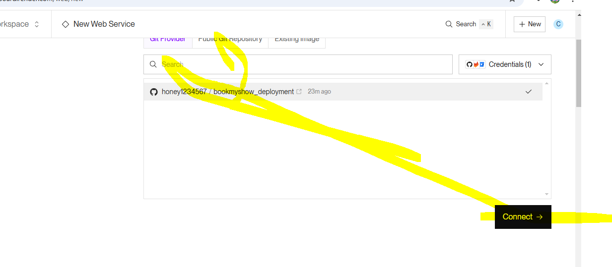
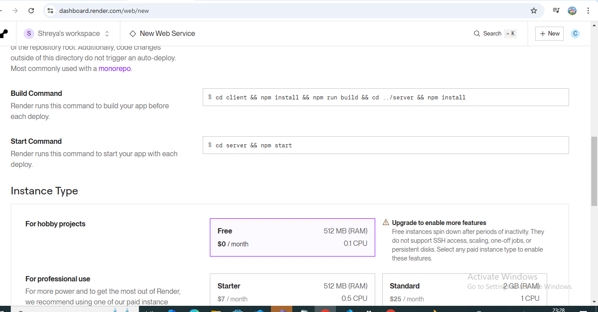
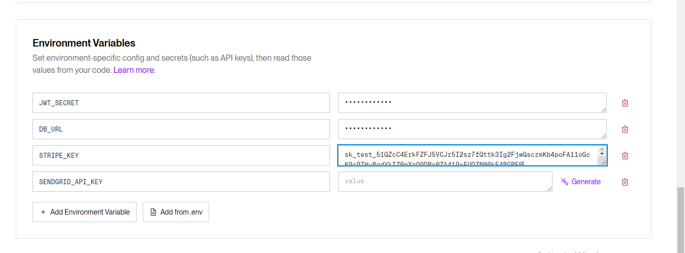

1. we will not push env file on github
1. npm init -y
2. npm install express mongoose bcryptjs jsonwebtoken
3. install nodemon at global level.
4. npm install --save dotenv    <!-- to use process 
5. npm install nodemailer
npm install express-rate-limit
npm install express-mongo-sanitize
npm i helmet
-->.
 npm install stripe
 # server
 useing smtp server send and sort email to destination post office
 SMTP(postoffice) with nodemailer and sendgrid is a person who will send and receive email

## steps for deployment

## Deplyment site: https://dashboard.render.com

# Step 1: Prepare Your MERN App

a. Set Up Your MERN App: Make sure your MERN app is working
perfectly on your local machine. Your app should be divided into
client (React) and server (Node.js, Express) directories.

b. Create a Production Build: Navigate to your React client directory
and run:

c. npm run build

d. This will create a production build of your React app in a build
folder

# Step 2: Set Up a Git Repository

a. Initialize a Git Repository: If you haven’t already, initialize a git
repository in the root directory of your project:

b. git init

c. Commit Your Code: Add your files and make an initial commit:

d. git add .

e. git commit -m "Initial commit"

f. Push to GitHub: Create a repository on GitHub and push your
code to it:

g. git remote add origin <your-github-repo-url>

h. git push -u origin main

# Step 3: Set Up Render Account and New Web Service

a. Sign Up or Log In to Render: Go to Render and sign up or log in to
your account.

b. Create a New Web Service: Click on the “New” button and select
“Web Service.”

# Step 4: Connect to Your GitHub Repository

a. Authorize GitHub: Connect Render to your GitHub account if you
haven't done so already.

b. Select Repository: Choose the repository that contains your
MERN app

# Step 5: Configure the Service

a. Basic Settings:

b. Name: Choose a name for your service.

c. Region: Select a region close to your users.

d. Build Command: Add the build commands to set up your project.
If your server code is in a folder named server, you might use:

e. cd client && npm install && npm run build && cd ../server && npm
install

f. Start Command: Specify the command to start your server. For
example:

g. cd server && npm start

# Step 6: Environment Variables
a. Add Environment Variables: Click on “Add Environment Variable”
to add any necessary environment variables such as
MONGODB_URI, JWT_SECRET, etc.

## Step 7: Correct your base URL in client -> src/api/index.js

## Step 8: 